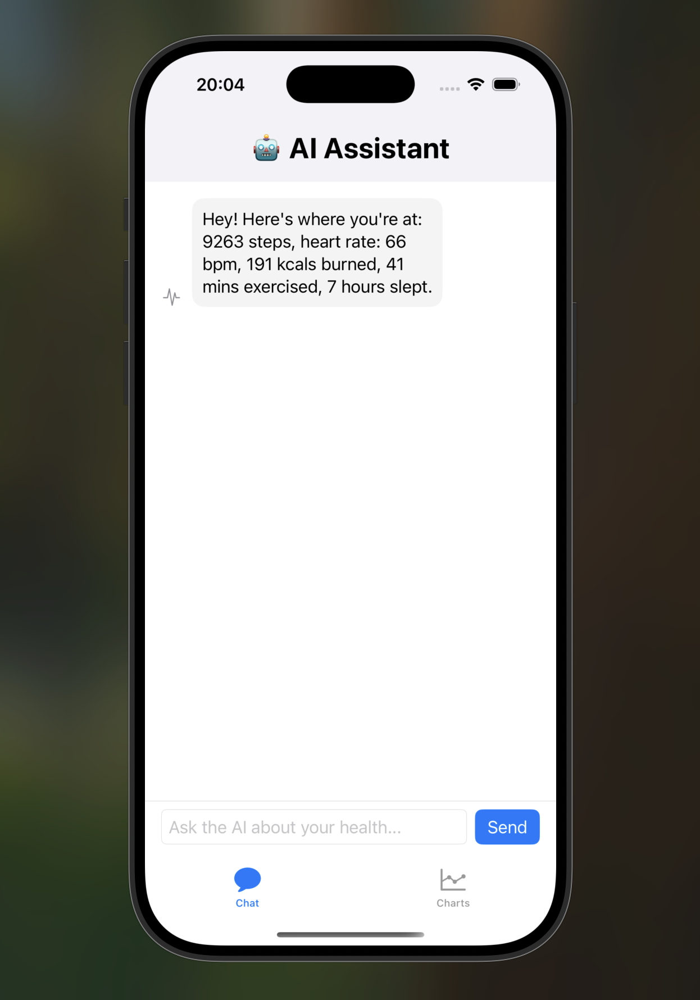
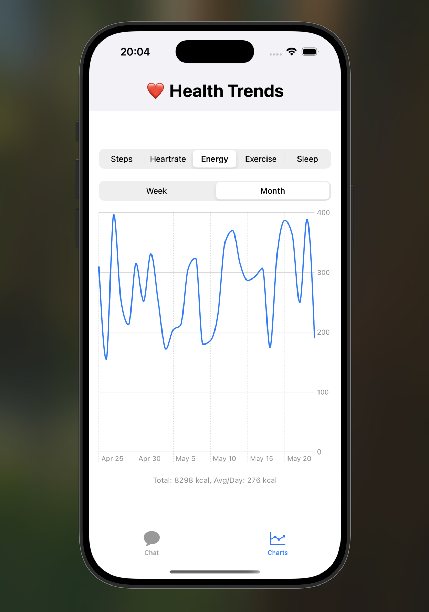

# HealthAI

HealthAI is a SwiftUI iOS app that integrates Apple HealthKit and an AI-powered chatbot to help users monitor their health metrics and receive personalized feedback.

## Features

- 🧠 AI chat interface that summarizes and interprets your health data
- 📈 Health charts for Steps, Heart Rate, Energy Burned, Exercise Time, and Sleep Duration
- 🛠️ Built with SwiftUI, Charts framework, and OpenRouter's DeepCoder 14B LLM

## Screenshots




## Setup Instructions

1. **Clone the repository**  
   ```bash
   git clone https://github.com/your-username/HealthAI.git
   cd HealthAI
   ```

2. **Open the project in Xcode**  
   Make sure you have Xcode 15 or later.

3. **Add your OpenRouter API key**
   - Go to [DeepCoder 14B Preview on OpenRouter](https://openrouter.ai/agentica-org/deepcoder-14b-preview:free)
   - Sign up or log in
   - Create an API key from your OpenRouter account
   - Open `LLMService.swift` and replace:
     ```swift
     private let apiKey = "your-api-..."
     ```
     with your actual key.

4. **Run the app**
   - Use an iOS Simulator or a physical device.
   - Allow HealthKit permissions on first launch.

## Technologies Used

- **SwiftUI** – Declarative UI framework by Apple
- **HealthKit** – Access health data on iOS
- **Charts** – Visualize trends
- **OpenRouter API** – Uses `agentica-org/deepcoder-14b-preview:free` LLM for AI chat
